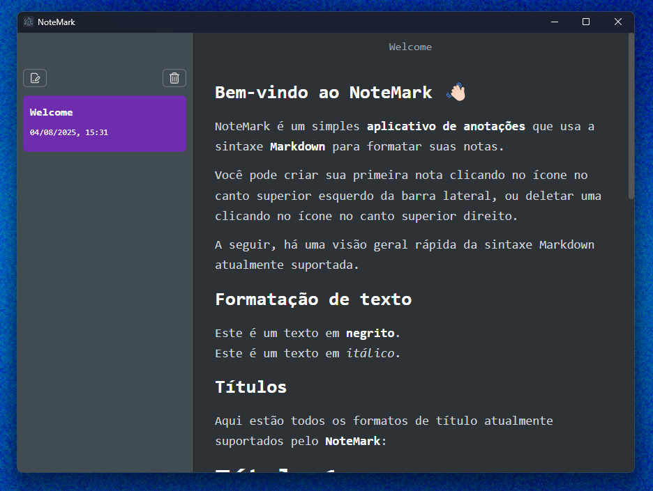
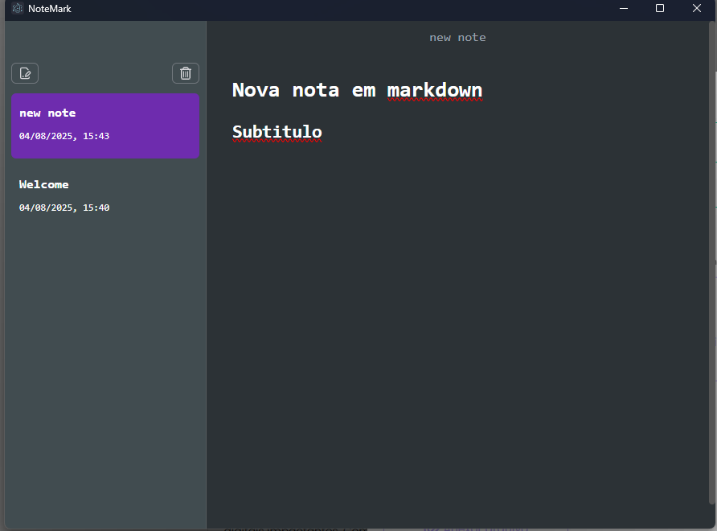
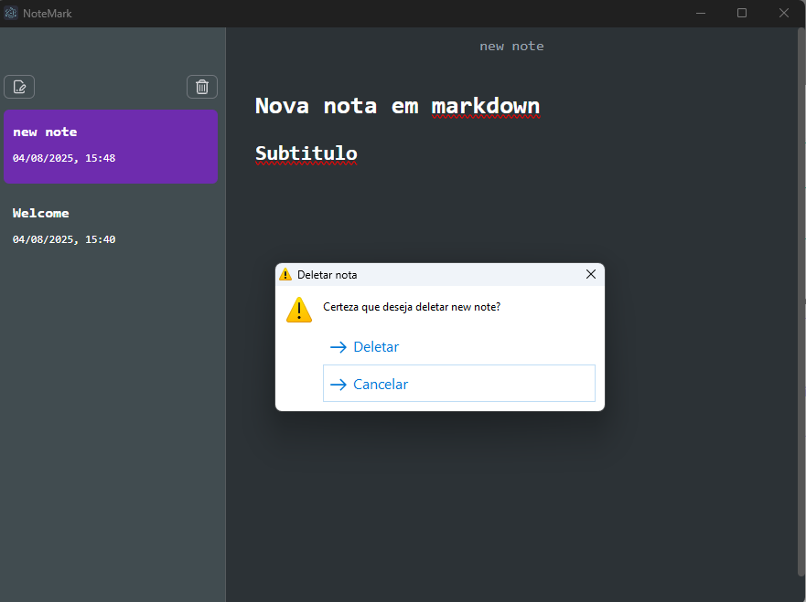

# 📝 Notemark App

**Notemark** é um aplicativo desktop de anotações desenvolvido com **ElectronJS**, que permite criar e gerenciar notas com suporte à **sintaxe Markdown**. O app conta com uma interface simples e intuitiva, ideal para quem deseja organizar suas ideias de forma prática e estilizada.

## ✨ Funcionalidades

- ✅ Criação de novas notas com data e horário automaticamente registrados
- 🗑️ Exclusão de notas com confirmação
- ⏱️ Lista de notas exibida em ordem de criação
- 🧱 Suporte à **formatação Markdown**
- 🖥️ Aplicação desktop multiplataforma (Windows/Linux/Mac)

## 📸 Capturas de tela

### Tela de boas-vindas com exemplos de Markdown


### Editor com suporte a Markdown


### Modal de confirmação ao deletar uma nota


## 🛠 Tecnologias utilizadas

- [ElectronJS](https://www.electronjs.org/)
- [JavaScript](https://developer.mozilla.org/pt-BR/docs/Web/JavaScript)
- [React](https://react.dev/)
- [Typescript](https://www.typescriptlang.org/)
- [ Tailwind CSS](https://tailwindcss.com/)
- [Jotai](https://jotai.org/)
- Markdown

## 🚀 Como executar localmente

```bash
# Clone este repositório
git clone https://github.com/seu-usuario/electron-md-notes.git

# Acesse a pasta do projeto
cd electron-md-notes

# Instale as dependências
yarn

# Execute o app em modo desenvolvimento
yarn dev

### Build

# For windows
$ yarn build:win

# For macOS
$ yarn build:mac

# For Linux
$ yarn build:linux
```
